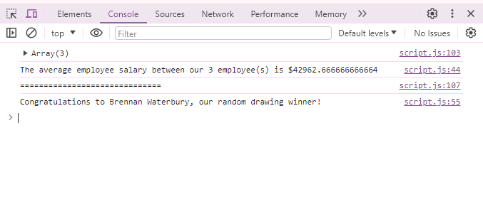
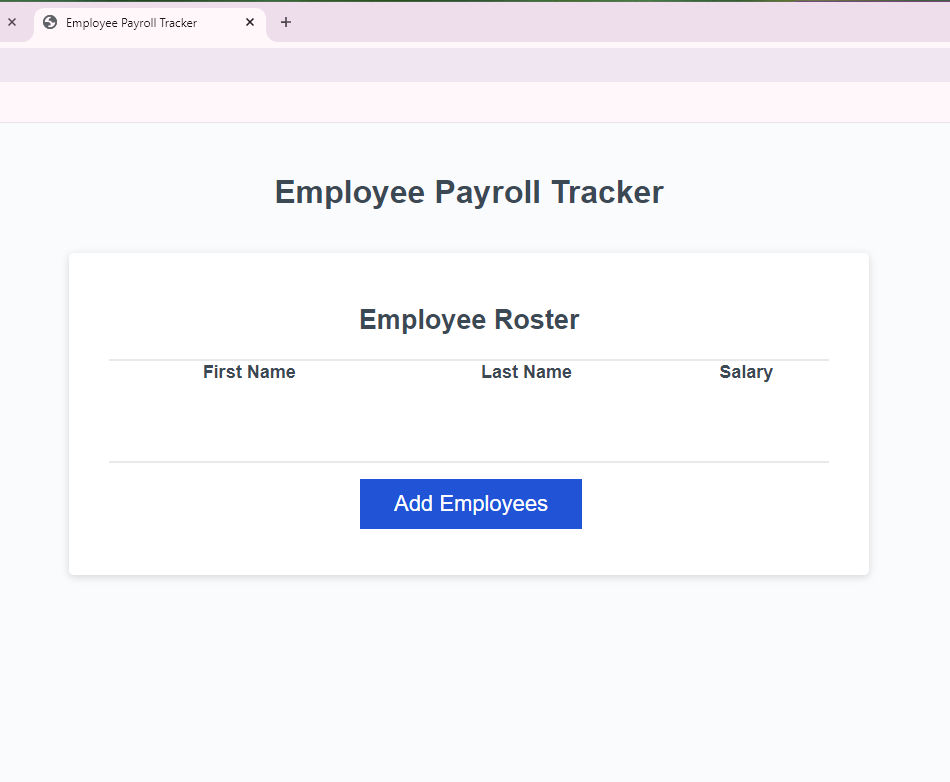

# Employee Payroll Tracker
Improve the functionality of the code.

## Description
An employee payroll tracker for a company that would like to have a more efficient method of logging their payroll. You can also get an average salary in the console after logging the employees, and their salary.

## Badges
Shields.io

## Visuals
Link: <a href="https://bwater47.github.io/Week-3-Challenge/">Employee Payroll Tracker</a>

Screenshots:  

## Installation
N/A

## Usage
You can use this website to log your payroll for your employees, and see the average salary of however many employees you have.

## Support
You can contact support through email by emailing brennw47@gmail.com.

## Roadmap
N/A

## Contributing
Contributing is allowed if you're in the U of U Coding Bootcamp. Contact me on on the slack channel for information.

## Authors and acknowledgment
Bootcamp Spot. (03/18/2024). https://bootcampspot.com/

W3Schools Online Web Tutorials. (03/18/2024). https://www.w3schools.com/ 

Chatgpt. ChatGPT. (03/18/2024). https://openai.com/chatgpt

• Please note: While ChatGPT was utilized to generate dialog content for the README file, it was not involved in the generation of any code, HTML edits, CSS edits, or other assets within the repository apart from this README specifically.

• All other sources, links, and information utilized within the project were obtained from the provided sources mentioned in this paragraph. This includes class materials, modules, TA guidance, instructor-provided resources, as well as communication through platforms such as Slack or Discord. Additionally, numerous links and resources were provided within the assignment instructions and demonstrated during class sessions.

## Project status
N/A